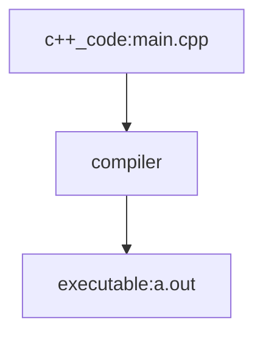

# Lecture Notes

## table of contents
1. programming languages intro
2. Environment Setup
3. Terminal Basics
4. .gitignore and developing in this repo without git conflicts
5. Compilation and Arguments


## programming languages intro
A cpu is designed to execute instructions. When a programmer writes code, 
each line must be converted to a cpu instruction. This conversion is 
done by a compiler. A compiler is a software on your computer designed
to translate code written by a human, to code(binary) that can be read and
executed by your cpu.

A **low-level programming language** is a type of programming language that is closer to a computer's hardware and machine code than a high-level language.(examples: Assembly, and to some C) <br><br>
A **middle-level programming language** is a computer language that balances the features of high-level and low-level languages.(example is C++) <br><br>
A **high-level programming language** is a programming language that's designed to be easier for humans to understand and write.(example is python)<br><br>
The higher the level of a programming language implies a more complex and computationally expensive compiler. Higher level programming languages are written in lower level programming languages. For example, both python and c++ are written in c.   


## First Program 
### Code:
```cpp
#include<iostream>

using namespace std;

int main()
{
    cout<<"Hello World"<<endl;
    return 0;
}
```

### Breakdown:
1. ```#include<iostream>```
  * This is a preprocessor directive that includes the input-output stream library (iostream).
  * This library allows the use of cout and cin for output and input, respectively.

2. ```using namespace std;```
  * This statement allows the use of standard C++ library functions and objects (like cout) without explicitly writing std::cout.
  * Without this, you would need to use std::cout instead of just cout.

3. ```int main()```
  * The main function is the entry point of every C++ program.
  * The execution of the program starts from here.

4. ```cout<<"Hello World"<<endl;```
  * cout (console output) is used to print text to the screen.
  * "Hello World" is the string that gets printed.
  * endl moves the cursor to a new line (it is equivalent to \n).
5. ```return 0;```
  * This statement indicates that the program has successfully executed.
  * Returning 0 is a convention that signifies successful execution to the operating system.

Output of the Code:
```bash
Hello World
```

### Steps for running program
1. Open a terminal, then navigate the terminal to where your code is located(using cd command). Example: ``` cd ./class_notes/1_intro_c++_programming``` 
2. Type the command(to compile): ``` g++ main.cpp ```
3. Type the command ``` ls ``` to see if your computer created the executable **a.out**(mac or linux) or **a.exe**(windows)
4. Type the command(to execute(run on cpu)): ```./a.exe ``` or ```./a.out ```


## Enivironment Setup
In this class, we will be working with the g++ compiler for c++ code. 
The simplest method to download the g++ compiler for any computer will be via docker.

### Tools we will be using
* Visual Studio Code (VS Code) is a source code editor that combines developer tooling with a fast edit-build-debug cycle
* Docker is a software platform that allows developers to build, test, and deploy applications in containers. It's an open-source platform that provides a way to separate applications from infrastructure, which can help speed up software delivery. 
* Git is a version control system (VCS) that allows programmers, software engineers, and developers to work together on projects. It's the most popular open-source VCS in the world and is used by millions of people every day.


### Installation links
* [docker install link](https://docs.docker.com/engine/install/)(Make sure to turn on wsl2 for if you're using windows)
* [git install link](https://git-scm.com/downloads)
* [vscode install link](https://code.visualstudio.com/download)
  * To install vscode extensions use the shortcut **ctrl+shit+x**, then search for the following:  
    * Dev Containers
    * C/C++ Themes

Once you have installed all the links above, open vscode and its terminal with shortcut **ctrl+`**, and navigate to where you want to download the github folder on your computer. Once you settle on a location, run the command<br> ```git clone https://github.com/canizalesjaime/algorithms_and_programming_mth4300.git```

Create a folder and name it **hidden**, inside this folder you can develop code that won't conflict with the class code.

To open the github directory in vscode, first open vscode, then open the directory algorithms_and_programming_mth4300 by going to **File** on top left then press **Open Folder...** and select algorithms_and_programming_mth4300 folder. Everytime you open the folder in vscode you should open a terminal using the shortcut **ctrl+`** then run the command ```git pull```. This will update any changes I have made recently to the directory.


## Terminal Basics
In this class we will be using the terminal as a means for interacting with our computer. To acces the terminal in vscode use the shortcut **ctrl+`**. 
### List of useful commands(Note the terms directory, and folder are the same thing):
* **pwd :** print the working directory(where your terminal is operating from)
* **cd :** change directory (changing working directory to another directory) ```cd directory_path```
* **mv :** move a file to another location ```mv file_to_move location_to_move_file```
* **cp :** copy a file  ```cp file_to_copy location_to_copy_file```
* **mkdir :** create a directory ```mkdir new_folder_name```
* **ls :** show all files in the working directory
* **g++ :** compile a *.cpp file into a.out
* **./ :** shorcut for this directory ```./a.out``` (is saying in this directory execute a.out(analogous to clicking on file)) 
* **../ :** refers to the parent directory. ```cd ../```(changes the working directory to the parent directory)


## .gitignore and developing in this repo without git conflicts
When using git, sometimes you may want to code your own stuff in this repo, but you will notice that if you add your own code, then try to ```git pull``` changes you get a git conflict error. In order to solve this problem we use the **.gitignore** file. The **.gitignore** file is a special file in git, that allows us to ignore files and directories(aka repos and folders) from causing changes to the git repo. Check out the .gitignore file [here](../../.gitignore), in the .gitignore file, you can see that we added a line ***hidden/**, this line allows us to create a folder named **hidden** anywhere, and it will not conflict with anything in the git repo.


## Compilation and Arguments
So far we have seen compilation like this: ```g++ main.cpp``` and we know that this will create an a.out file. Sometimes we may have multiple files in a directory, say **main1.cpp** and **main2.cpp** and we don't want the compilation of **main1.cpp** to overwrite the compilation of **main2.cpp**. To solve this problem, we can simply just name the compilation of **main1.cpp** as  main1.out and **main1.cpp** as main2.out. To change the name of output executable file produced by g++ we use the `-o` flag. <br>
**Example:**
```
g++ main1.cpp -o main1.out
g++ main2.cpp -o main2.out
```
**Produces:**<br>


